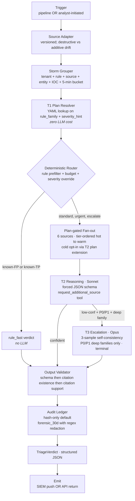

# triage-agent

A per-tenant SecOps alert triage service. Deterministic where determinism works, LLM-reasoned where evidence matters, citation-validated, audit-logged.

**Signal.** 179 tests passing · 0.933 SUT exact-match · 0.085 ECE · 1.000 adversarial pass rate · 0 LLM control-plane calls. Full evidence in [DESIGN.md](DESIGN.md) and the numbered commitment log in [ARCHITECTURE-DECISIONS.md](ARCHITECTURE-DECISIONS.md) (34 decisions).

---

## What production failure mode does this solve?

SIEM alerts land in the analyst's queue every few minutes. The bottleneck isn't reading the alert — it's pivoting across identity provider, threat intel, asset CMDB, historical alerts, runbooks, and log search to answer whether the alert is real, what the blast radius is if it is, and what action is justified. Manual pivoting is 10-15 minutes per alert.

Existing options fail two different ways. Rule-based triage misses novel patterns and can't reason across evidence. Unbounded LLM-based triage is nondeterministic on control-plane decisions, expensive under bursts, and produces prose the SIEM workbench can't consume. This service splits the difference: deterministic tiers absorb the alerts that don't need reasoning; the LLM tier reasons only over evidence that was gathered by deterministic policy. Output is typed JSON the analyst's existing workbench renders directly.

## What is deterministic vs LLM-mediated?

The line is explicit and load-bearing. LLMs are not trusted with control-plane decisions — which tier runs, which source fires, when to escalate — only with reasoning over the evidence those decisions surface.

**Deterministic (zero LLM cost):**
- Rule prefilter — known-FP and known-TP patterns at the top of the router
- Storm grouper — burst-window deduplication keyed on tenant + rule + source + entity + IOC + 5-min bucket
- T1 plan resolver — YAML lookup on `(rule_family, severity_hint)` returns an `InvestigationPlan`; the plan names which of six sources fetch and in what tier order
- Router — rule prefilter → per-tenant budget envelope → severity-aware override; P0 in deep families can never silently skip

**LLM-mediated (Sonnet at T2, Opus at T3):**
- T2 reasoning — Sonnet in forced-JSON mode over the enriched evidence bundle; can call `request_additional_source` up to two plan extensions per alert
- T3 escalation — Opus, 3-sample self-consistency, fires only when T2 returns `confidence < 0.6` AND `severity in {P0, P1}` AND `rule_family in {ransomware, privilege_escalation, data_exfil, dns_exfil}`; terminal pass, no further plan extension

`llm_control_plane_calls: 0` is measurable, not aspirational.

## How are citations, evals, and validation enforced?

Two layers, not one. Most published SOC agents validate citation **existence**: the model says it used source X; the orchestrator confirms source X was queried. This service adds citation **support**: every `observed_fact` carries `retrieval_id`, `field_path`, and `expected_value`. The validator walks the cited retrieval and confirms the field actually contained that value. Catches the "real ID, wrong content" attack that existence-only validation misses.

**Numbers from `uv run eval` against the 30-alert gold set + 12-alert adversarial set:**

| Metric | Value |
|---|---|
| SUT exact-match | 0.933 |
| Adversarial pass rate | 1.000 |
| Expected calibration error (ECE) | 0.085 |
| Citation existence rate | 1.000 |
| Cost per alert (SUT vs naive baseline) | 5-8× cheaper |
| Tests | 179 passing (~1.5s) |

Eval methodology in [DESIGN.md §8](DESIGN.md), including honest measurement limits in §8.1 (why action-validity 1.000 is misleading and what actually enforces correctness).

## What breaks safely?

Every named failure ships with a named mitigation and an explicit residual risk. The full matrix is in [DESIGN.md §6](DESIGN.md); the load-bearing four:

- **LLM provider outage.** Pipeline never blocks. Fast-path verdicts continue; T2 path emits `degraded: llm_unavailable` with reduced confidence. Analyst sees the degrade flag, not a stalled queue.
- **Schema or citation-support double-failure.** Validator emits a hardcoded `needs_human` verdict with `degraded: validation_failure_*`. The pipeline never raises uncaught. Analyst acts on the degrade signal.
- **Budget exhaustion on P0.** Severity-aware override forces P0/P1 of deep families through to T2 with `needs_human_urgent`; metric `budget_exceeded_p0_override` fires. Tested in `test_budget_override.py`.
- **Prompt injection via alert summary, runbook, or log lines.** Four layers stack: closed-vocabulary schema, retrieval-ID allowlist, citation support validation, and `automatable: false` on every recommendation. Adversarial eval set (12 alerts) probes exactly this class.

Storm cost runaway, stale threat intel, tenant data leakage, hallucinated citations, lazy-analyst correction poisoning, and adversarial uploaded runbooks are all in the §6 matrix with named mitigations. `automatable: false` is the design default on every recommendation.

## How does this generalize?

The shape is: **structured input → deterministic prefilter → deterministic plan lookup → LLM-reasoned with citation-validated evidence → structured audit-logged output.** Any workflow that fits this shape gets the same architecture:

- **AIOps alert triage** — same primitives; noise sources are asset registry, deployment log, runbook, historical incidents.
- **Support ticket routing** — rule-based T1 handles known FAQs and product areas; LLM T2 reasons over the enriched ticket bundle with knowledge-base citations.
- **Incident triage** — deterministic categorization + severity gate → LLM reasoning over evidence → structured post-mortem-ready output.
- **Fraud triage, compliance review, medical claims triage** — same three-tier discipline; the domain sits in the YAML plans and the source registry, not in the engine.

The engine is surface-agnostic by design (see §2 in DESIGN.md — trigger and emit are pluggable bookends). The pattern is portable; the domain is where the work lives.

---

## Architecture



Full flow diagram (ASCII, with return semantics) and per-node rationale in [DESIGN.md §2](DESIGN.md).

## Reviewer quickstart

Requires Python 3.12 and [uv](https://docs.astral.sh/uv/). No Anthropic API
key required.

```bash
uv sync
uv run demo     # one alert through T1 -> enrichment -> T2 -> validation -> verdict
uv run eval     # gold + adversarial sets; writes a report to eval/reports/
uv run pytest   # 179 tests in ~1.5s
```

Run `uv run eval` first on a fresh clone — one test asserts that a report
exists, so a `pytest`-first run will show that test skipped.

Tests use `FixtureReplayClient` and `SequenceClient`; eval and the default
local API use `EvalSyntheticClient` so review runs are deterministic and do
not require an API key. The live Anthropic path was exercised once and the
captured Opus response lives at
[`fixtures/llm_replays/cd8a1be0d7d1e45f1148e61c.json`](fixtures/llm_replays/cd8a1be0d7d1e45f1148e61c.json)
with `live_api: true`, `captured_at: 2026-06-16T04:29:49Z`, and real token
counts in the fixture metadata. The notebook's T3 cell replays that
captured response.

## Production patterns demonstrated

Named the way a JD would ask about them.

- **Deterministic control plane, LLM data plane.** Routing, plan resolution, tier ordering, budget enforcement — zero LLM. Reasoning tier runs only over evidence gathered by deterministic policy. Measurable as `llm_control_plane_calls: 0`.
- **Plan-gated retrieval.** T1 resolves an `InvestigationPlan` from YAML; fan-out fetches only listed sources; T2 extends the plan via a bounded `request_additional_source` tool call (capped at two extensions). Targeted-then-extend, not fetch-everything-then-reason.
- **Tier-aware storage cost.** `RetrievalRef.storage_tier` ∈ {hot, warm, cold}; default plans exclude cold; cold is opt-in via T2 plan extension only.
- **Multi-tier LLM escalation.** T2 Sonnet on the common path; T3 Opus with 3-sample self-consistency, terminal, only when `confidence < 0.6` AND `severity ∈ {P0, P1}` AND `rule_family` is in the deep-family set.
- **Citation existence + citation support validation.** Two layers: source-queried check, then `field_path`-walks-and-confirms-`expected_value` check on the cited retrieval. Rejects "real ID, wrong content" attacks that existence-only validation misses.
- **Closed-vocabulary structured verdict.** Pydantic `Literal` types on verdict, severity, action, MITRE tactic. Ungrounded outputs are structurally invalid; downstream automation matches exact strings.
- **Audit ledger with retention class.** Default `hash_only`; raw payloads gated to `forensic_30d` with regex redaction (AWS keys, bearer tokens, generic API keys, PII).
- **Per-tenant correction loop, soft plus hard.** Soft layer auto-caps verdict to `likely_*` on operational signal; hard layer requires detection-engineering acknowledgment. Lazy bulk-FP can't poison routing.
- **Storm dedup.** Burst-window grouper keyed on tenant + rule + source + entity + IOC + 5-min bucket. Member alerts attach to an `IncidentGroup` and bypass the LLM tier.
- **Deterministic eval harness.** `EvalSyntheticClient` makes eval reports reproducible across machines. `FixtureReplayClient` + `SequenceClient` keep the 179-test suite API-key-free.

Each pattern is a numbered decision in [ARCHITECTURE-DECISIONS.md](ARCHITECTURE-DECISIONS.md) with the choice, the rationale, and what was rejected.

## What it is

The service is surface-agnostic: trigger and emit are pluggable bookends.
Trigger can be automatic when an alert is created in the pipeline, or
on-demand when an analyst requests triage by alert ID. The verdict can push
back to the SIEM as `triage.*` fields on the alert record, or return via the
API. Same engine, different bookends per deployment.

Output is structured JSON: closed-vocabulary verdict, grounded
observed_facts with citation-support validation, MITRE ATT&CK attack_chain
mapping, and explicit blast_radius + reversible flags on every
recommendation.

See [DESIGN.md](DESIGN.md) for the architecture and tradeoffs,
[ARCHITECTURE-DECISIONS.md](ARCHITECTURE-DECISIONS.md) for the numbered
commitment log, and [AI_TOOLS.md](AI_TOOLS.md) for how AI tools were used
during the build.

## Run the API surface locally

```bash
uv run uvicorn triage.api.main:app --reload
```

By default, the API uses deterministic local responses so the reviewer can
inspect the structured verdict shape without an API key. The live Anthropic
client is opt-in via the environment variables below.

The service exposes:

- `POST /triage` — full pipeline on a vendor payload (`{raw_payload,
  tenant_id, source_system}`)
- `POST /triage/{triage_id}/correct` — analyst correction (soft layer)
- `POST /api/v1/calibration/{tenant}/{rule_family}/force-review` —
  detection-engineering ack (hard layer)
- `GET /health` — liveness + LLM client mode

In another terminal, smoke-test the local API:

```bash
curl -s http://127.0.0.1:8000/health | uv run python -m json.tool

uv run python -c 'import json; from pathlib import Path; payload=json.loads(Path("fixtures/okta/sample_v1_clean.json").read_text()); body={"raw_payload":payload,"tenant_id":"tenant_a","source_system":"okta"}; Path("/tmp/triage_api_smoke.json").write_text(json.dumps(body))'

curl -s -X POST http://127.0.0.1:8000/triage \
  -H "Content-Type: application/json" \
  --data-binary @/tmp/triage_api_smoke.json | uv run python -m json.tool
```

Expected: `/health` reports `llm_client_mode: synthetic`, and `/triage` returns an expanded structured verdict for `okta_evt_clean_0001` with observed facts, inferences, recommendations, uncertainty, and audit pointer.

To switch to the live Anthropic client:

```bash
export ANTHROPIC_API_KEY=sk-...
export TRIAGE_LIVE_LLM=1
uv run uvicorn triage.api.main:app
```

## Walkthrough notebook

[`notebook.ipynb`](notebook.ipynb) walks end-to-end on three sample alerts:
impossible_travel (happy path), impossible_travel against stale/unknown
threat intel, and a ransomware P0 routing through T3 escalation. It renders
on GitHub directly; run locally with `uv run jupyter lab notebook.ipynb` to
re-execute the cells.

## Design highlights

- **Surface-agnostic triage service — trigger and emit are pluggable per
  deployment.** Automatic from the pipeline OR on-demand by alert ID; verdict
  pushes to the SIEM as `triage.*` fields OR returns via API. Same engine
  regardless of how invoked or where the verdict lands.
- **InvestigationPlan resolved deterministically per `(rule_family, severity_hint)`.**
  T1 is a YAML lookup, not an LLM call — detection-engineering policy stays
  with detection engineers. Plan-gated fan-out fetches only the sources the
  plan names; T2 may request more via tool call when reasoning identifies
  a gap (bounded by per-tenant budget envelope).
- **Tier-aware cost story.** `tier_preference` orders hot → warm; cold
  tier is opt-in via T2 plan extension only, never the default.
- **Citation support validation.** Every observed_fact carries a
  `field_path` and `expected_value`; the validator walks the cited
  retrieval and checks the field actually contained that value. Catches
  "real ID, wrong content" attacks that existence-only validation misses.
- **Audit by hash, raw payloads behind retention class.** The default
  retention class is `hash_only`; raw payloads land in `forensic_30d`
  after regex-based redaction for AWS keys, AWS secrets, bearer tokens,
  generic API keys, and email PII.

## Documentation

- [`DESIGN.md`](DESIGN.md) — architecture, tradeoffs, failure modes
- [`ARCHITECTURE-DECISIONS.md`](ARCHITECTURE-DECISIONS.md) — numbered architecture decisions (D1–D34): the choice, the rationale, and what was rejected
- [`AI_TOOLS.md`](AI_TOOLS.md) — how AI tools were used during planning and implementation
- [`notebook.ipynb`](notebook.ipynb) — three-scenario walkthrough

## Repository layout

```
src/triage/
├── adapters/         # Source adapters (Okta v1; protocol for the rest)
├── audit/            # Hash-based audit ledger + redaction
├── classifier/       # T1 deterministic plan resolver (YAML lookup)
├── corrections/      # Soft + hard layer correction loop
├── enrichment/       # 6 source mocks + plan-gated tier-ordered fan-out
├── errors/           # Drift + isolation exceptions
├── grouping/         # Storm grouper (single-worker singleton)
├── llm/              # Client abstraction + budget envelope
├── observability/    # Per-source enrichment spans
├── orchestrator/     # End-to-end pipeline wiring
├── reasoning/        # T2 Sonnet + T3 Opus escalation
├── routing/          # Deterministic router
├── schemas/          # Pydantic models (alert, plan, retrieval, verdict)
├── tenants/          # Tenant-scoped store
├── validation/       # Schema + citation existence + support + terminal failsafe
└── api/              # FastAPI surface

eval/
├── gold/             # 30 hand-labeled alerts (6 per family × 5 families)
├── adversarial/      # 12 adversarial alerts
├── baselines/        # naive (single Sonnet) + rule-only (Sigma-style)
├── synthetic_llm.py  # Deterministic eval client
├── metrics.py        # Accuracy + ECE + reliability diagram
└── run.py            # `uv run eval` entry

tests/                # ~180 tests covering adapters, routing, validation, audit, API
fixtures/             # plan templates + 2 tenants + Okta payloads + LLM replays

DESIGN.md                    # Architecture + tradeoffs + failure modes
ARCHITECTURE-DECISIONS.md    # Numbered architecture decisions (D1–D34)
AI_TOOLS.md                  # How AI tools were used during the build
notebook.ipynb               # End-to-end walkthrough
```

## License

MIT.
